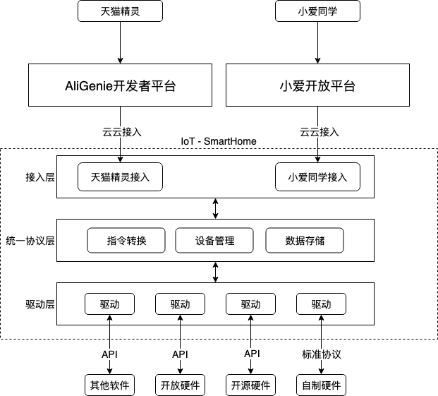

# Iot - SmartHome

## 介绍

随着物联网技术的发展，智能家居也逐渐进入了大众的视野。如今市面上的智能家居生态由几个商业巨头引领，为用户提供了安全和完善的使用体验。但是这些生态都不是个人所能融入的，这对于想要自己开发一些小型智能设备的 Geek 而言，并不是一个好事情。

因此我们发起了这个开源项目。这个项目旨在提供一个完整的智能家居厂商到智能设备的连接，最大化的降低智能设备爱好者的负担。

## 贡献指南

### 添加新特性
1. 在 [comunity](https://github.com/iotsh/community) 项目中发起 Issue，讨论你的想法
1. Fork [community](https://github.com/iotsh/community) 项目
1. 将你的想法写成文档，放在 [community](https://github.com/iotsh/community) 的指定目录中，然后提交 PR
1. 等待项目成员合并 PR
1. 提交特性相关的内容到对应的代码仓库中

### 修复 Bug
1. 在对应项目中发起 Issue 讨论这个 Bug
1. Fork 存在 Bug 的项目
1. 修复 Bug 并向对应项目提交 PR
1. 等待项目成员合并 PR

