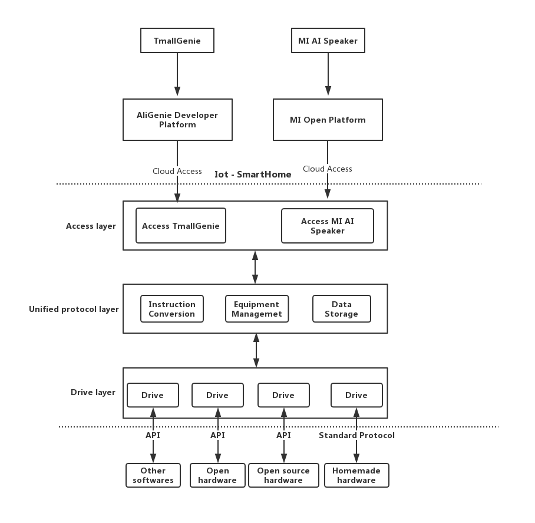

# Iot - SmartHome

----
With the development of Internet of Things technology, smart homes have 
gradually entered the public's field of vision. Today's smart home 
ecosystem is led by several business giants, providing users with a safe and 
complete experience. But these ecology are not personally integrated, 
which is not a good thing for Geek who wants to develop some small smart devices.

So we launched this open source project. This project aims to provide 
a complete connection between smart home manufacturers and smart devices,
maximizing the burden on smart device enthusiasts.

## Contributing

Please see [CONTRIBUTING.MD](CONTRIBUTING.md)

### News

1. Launch Issue in the [comunity](https://github.com/iotsh/community) project to discuss your ideas
1. Fork [community](https://github.com/iotsh/community) project
1. Write your thoughts as a document, place it in the specified directory of [community](https://github.com/iotsh/community), and submit the PR
1. Wait for project members to merge PR
1. Submit feature-related content to the corresponding code repository

### Issues

1. In the corresponding project, launch Issue Discussion this bug
1. Fork has a bug in the project
1. Fix the bug and submit the PR to the corresponding project
1. Wait for project members to merge PR

