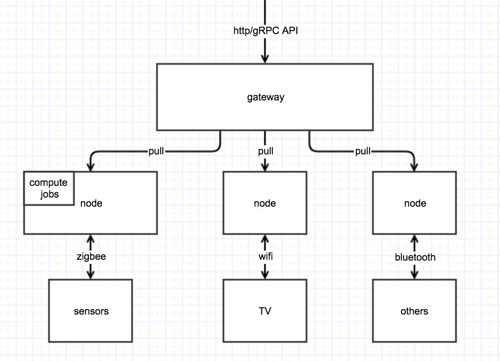

rchitecture design discussion for IoT

## Overview
本文讨论 IoT 系统的架构和设计思路，同步对整个系统的认知和理解。

## Goals
首先明确本系统的目标：
1. 连接成千上万的 IoT 设备
    1. 能够支持多种底层协议 (wifi, bluetooth, zigbee)
    2. 能够支持底层协议扩展
    3. 能够提供标准化的接入和设备发现方案
2. 易于理解和使用的 API 去管理设备状态
    1. 能够对外提供声明式 API
    2. 能够确保设备状态和 API 状态保持一致
3. 可扩展和标准化的 API
    1. 可以提供 API 扩展
    2. 可以提供基本组件的标准 API (e.g. switch)

## Architecture



1. gateway 是对外的网关，将网络划分为内部和外部，并对外提供 API
2. node 是计算节点，承担连接设备，运行计算任务，对 gateway 提供 API 等等职责
3. sensors, TV 等是 IoT device，zigbee 等是其支持的协议

### Design Q&A
#### Q: 为什么需要 node，而不用 gateway 直接管理 IoT device
以下几个原因：
1. 底层连接协议可能会有很多，未必所有的 node 都能支持所有的协议
2. 某些场景需要一些计算节点运行重资源的计算任务，如图片处理
3. 一个统一风格的 API 可以更好的为上层的场景设计编程提供支持
4. 降低底层设备的实现难度和开发成本

#### Q: node 需要实现什么功能
1. 支持特定协议的连接
2. 支持和硬件设备 sync 状态

### Problems
#### 如何在 device 和 node 之间进行状态同步
1. 状态的定义
2. 状态同步的协议

#### 如何抽象 device
三种选择，一是将所有 device 定义为同一种结构，类似 pod 的概念，主要专注于设备的基本状态管理，比如开关，是否正常工作等。
另一种是精确定义各种 device 的状态，认为不同的 device 是不同的结构，类似灯定义为 Light，门是 Door 这种。
最后一种类似于前两种的结合。比如将开关这种极其普遍的定义为一种结构，然后各种 device 通过基本结构组合。

第一种的优势在于好写，易于接受，劣势在于系统对于 device 无感知，带来的问题是无法基于此进行场景设计。

第二种的优势是如果实现了极其容易进行场景设计，问题是极难实现和推广。

第三种最大的问题是难以抉择什么是应当抽象的，什么是应当组合的。

## 流程整理
### 场景一：通过语音助手开灯
1. 用户表示要开灯
2. 天猫精灵发送语音数据到云端
3. 云端解析后发送操作到当前系统（通过 gateway 进入）
4. 系统内有应用解析操作后发送 API 请求修改灯泡状态
5. node 获取 API 修改事件后同步状态到灯泡
6. 灯泡打开

### 场景二：联动温度传感器和空调
1. 温度传感器提供室温数据
2. 系统内的应用发现室温偏高
3. 应用发送 API 请求修改空调状态
4. node 获取 API 修改事件后同步状态到空调
5. 空调打开

## Definition Example

```
type DeviceSpec struct {
    // e.g. mqtt, http, etc...
    // it also should support custom driver
    Drivers []string

    // on, off, unknown
    State DeviceState

    // kind of device
    // e.g. Light, TV
    Kind string
}
```
